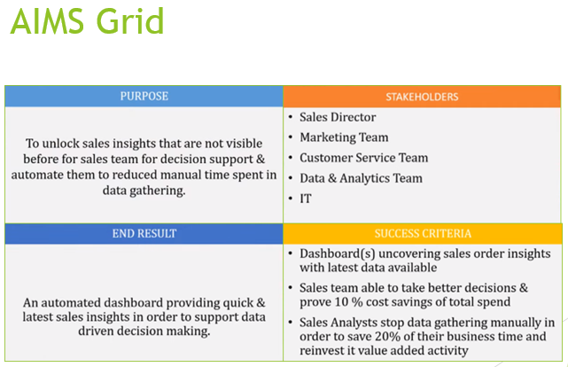
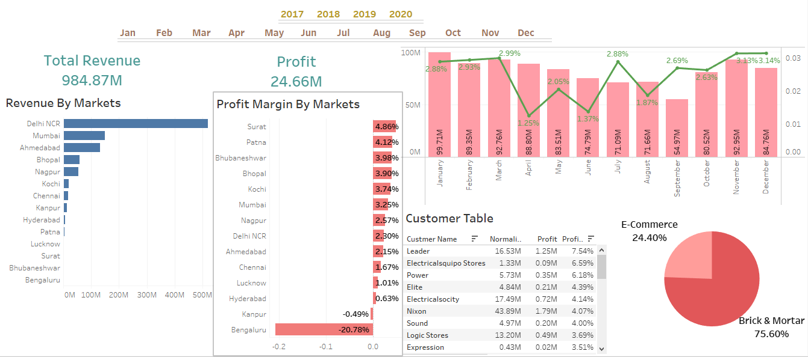
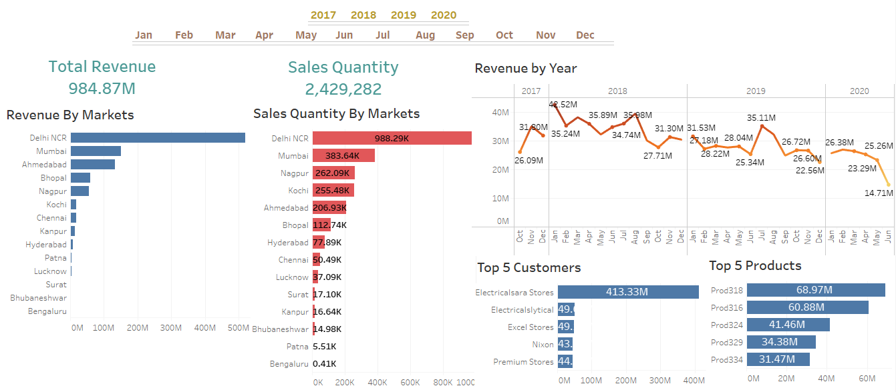

# Sales-Insights-Tableau-Dashboard

# Project Statement

A Delhi-based computer hardware manufacturing company AltiQ is facing challenges in dynamically changing market. Head Sales director of the company wants to identify where the business is failing. So you have been appointed by the sales director yo build an interactive dashboard that provides business insight to perform data driven-decision to maximize company profit. 

## Approach

### Business Understanding

Before venturing into the project, the AIMS grid was used for planning and laying the foundation for successful implementation.

### Data Engineering Cycle

Once the foundations where laid, the entire pipeline for dataflow was finalized ([read more](https://www.altexsoft.com/blog/datascience/what-is-data-engineering-explaining-data-pipeline-data-warehouse-and-data-engineer-role/)).

Usually, in such scenarios data from the data source such as OLTP are transformed using the ETL process before it gets loaded to a Data Warehouse, which is then connected to a BI tool to carry out the analysis.

For our case study, we have used a Tableau for data analysis that has a live connection with a MySQL data source.

 Fig:Database Schema

### Analyzing data using MySQL

 Fig: SQL Analysis

### Creating Visualization using Tableau

